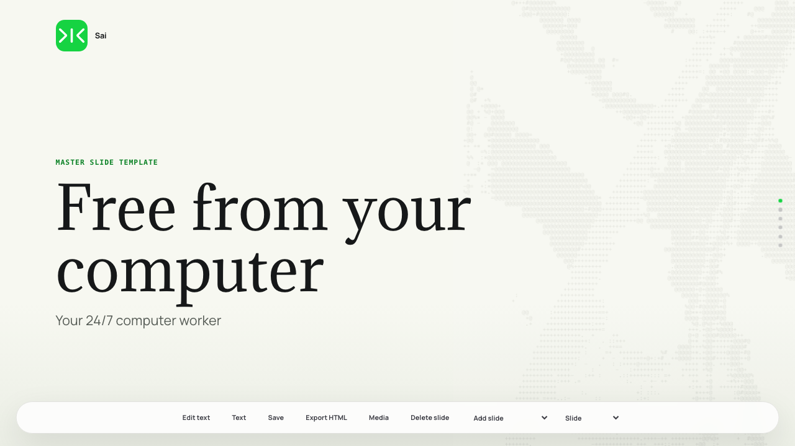
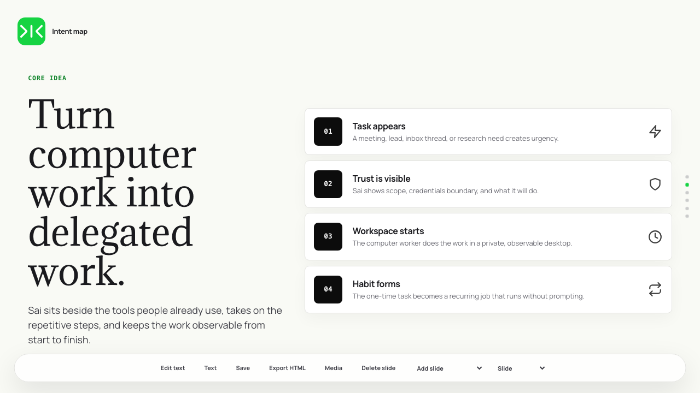
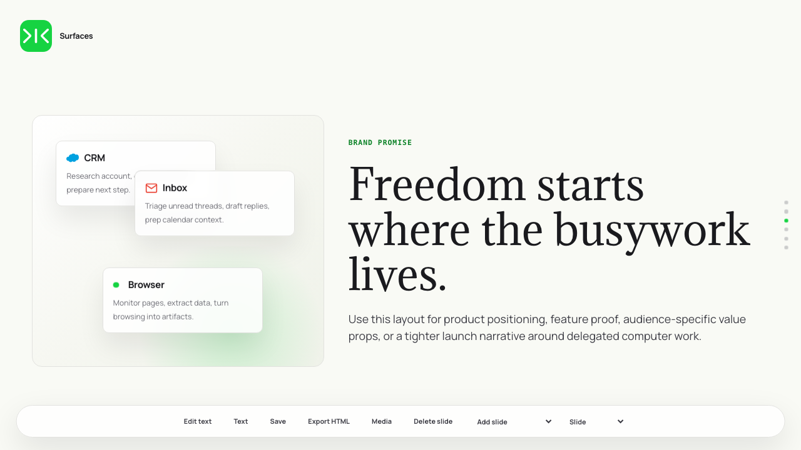
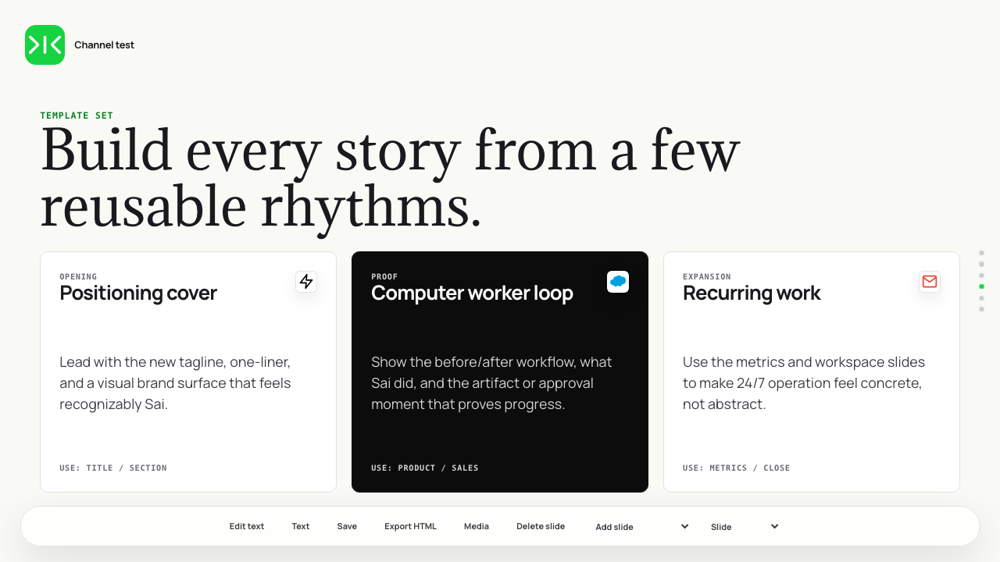
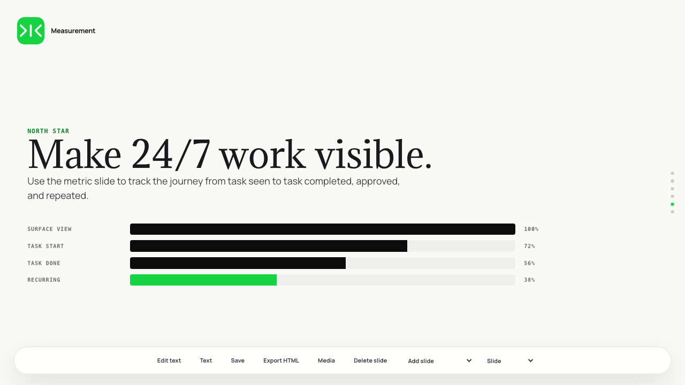

# Sai Master Slides Templates

Editable, browser-native master slide templates for Sai presentations.

This project packages a single-file HTML slide editor with Sai/Simular styling, editable text, slide templates, image/video import, a media sidebar, background image selection, slide animation, text motion, and export support.

> Built with [Codex](https://openai.com/codex) and the [Remotion](https://www.remotion.dev) plugin.

## Preview

| | |
|---|---|
|  |  |
|  |  |
|  | |

## What's Included

- `template/index.html` - the editable slide deck/editor
- `template/assets/` - bundled fonts, Sai/Simular marks, icons, integrations, brand art, and local media backgrounds
- `SKILL.md` - Codex skill instructions for using this project as a reusable slide-generation skill

## Use Locally

Open this file in a browser:

```text
template/index.html
```

The editor runs fully in the browser. No build step is required.

## Editor Features

- Edit text directly in the deck
- Use the `Text` dropdown for bold, italic, font family, and 1px font-size stepping
- Add slide templates
- Delete slides
- Import images and videos
- Uploading from the Media sidebar places the first uploaded asset onto the active slide immediately
- Generate colored ASCII art from uploaded images with transparent SVG backgrounds
- Drag, resize, replace, layer, fit, fill, delete, or set images as slide backgrounds
- Drag media-library assets directly onto the slide canvas; transparent/light assets preview on a checkerboard thumbnail
- Use the Media sidebar to choose bundled or uploaded background images/videos
- Apply text motion and slide animation
- Use Undo/Redo keyboard shortcuts: `Ctrl/Cmd+Z`, `Ctrl/Cmd+Y`, or `Ctrl/Cmd+Shift+Z`
- Save edits to browser localStorage
- Save the full `.slides-offset` state with `Ctrl/Cmd+S`
- Export the edited HTML

## Typography

- Headings: Adamina (`template/assets/Adamina-Regular.ttf`)
- Body, labels, and editor UI: Manrope (`template/assets/Manrope-VariableFont_wght.ttf`)

## Install As A Codex Or Claude Skill

This folder is compatible with skill loaders that use a standard `SKILL.md` file with YAML frontmatter. Keep the full folder together so the HTML template can find its assets.

For Codex, copy this folder into your Codex skills directory:

```bash
cp -R sai-master-slides-templates ~/.codex/skills/
```

For Claude, copy this folder into your Claude skills directory:

```bash
mkdir -p ~/.claude/skills
cp -R sai-master-slides-templates ~/.claude/skills/
```

Then restart or refresh the host app so the skill list reloads.

## Repo Structure

```text
sai-master-slides-templates/
├── README.md
├── SKILL.md
├── .gitignore
└── template/
    ├── index.html
    └── assets/
```

## Notes

Large user-uploaded videos can exceed browser localStorage limits. Bundled media files in `template/assets/media/` are referenced by path and are better for reusable background libraries.

When using the skill from either Codex or Claude, copy `template/` to an output folder before making project-specific changes. Treat the source `template/` as the reusable master.
